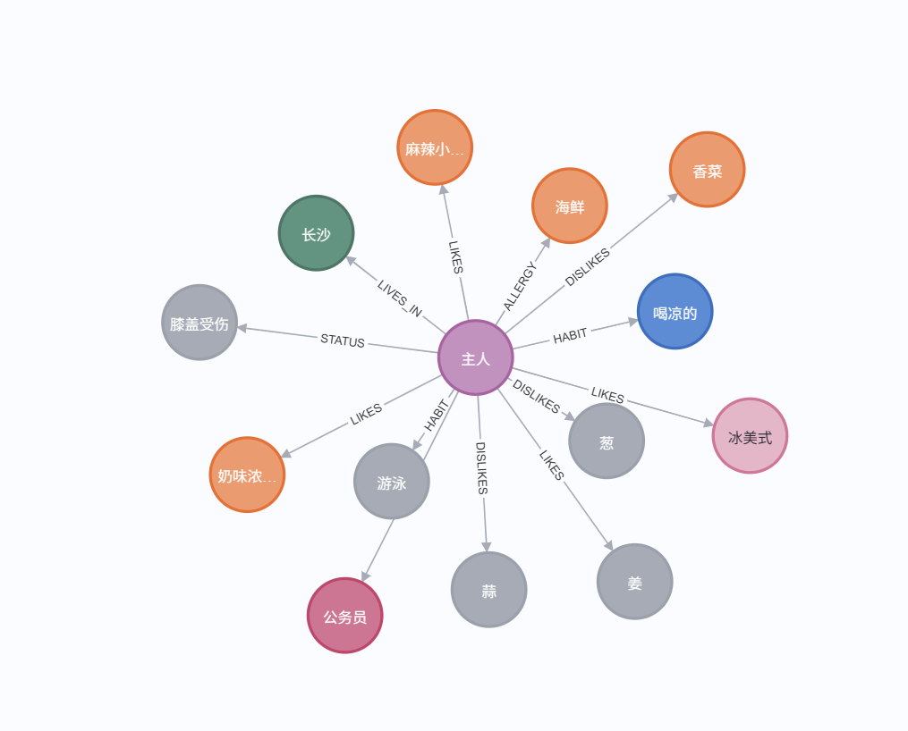

# 🎙️ Identity-Aware Multimodal Voice Agent (M-RAG-Voice)

> 一个具备**声纹身份感知**、**动态长期记忆**和**端云混合推理**能力的智能语音助手框架。

   

## 📖 项目简介

这是一个探索性的多模态语音交互系统。不同于传统的语音助手，该项目集成了**声纹识别 (Speaker Verification)** 和 **RAG (检索增强生成)** 技术。它不仅能听懂“你在说什么”，还能识别“你是谁”，并根据不同用户的身份调用专属的长期记忆库（如饮食习惯、历史偏好），提供高度个性化的回答。

### ✨ 核心特性

* **👥 多用户声纹识别**: 集成 CAM++ 模型，支持 1:N 声纹匹配。自动区分“主人”与“访客”，支持语音指令注册新用户。
* **🧠 动态进化记忆**: 基于 Milvus 向量数据库构建用户画像。具备“冲突裁决”机制，自动利用 LLM 分析新旧记忆冲突，实现记忆的自我更新与修正。
    * **本地部署Neo4j数据库**: 用于存储结构化的长期记忆和知识图谱。
    * **本地部署MilVus数据库**: 用于存储向量化的记忆片段，支持高效检索。
    * **与Mem0的区别:**: Mem0实现知识图谱时侧重插入，不强调数据一致性（向量库和知识图谱库），本项目强调数据一致性，通过冲突裁决机制确保长期记忆的准确性和可靠性。
* **⚡ 端云混合架构**:
    * **端侧 (Local)**: 运行高频、低延迟任务（VAD, ASR-SenseVoice, SV-CAM++, TTS）。
    * **云侧/端侧灵活性**: LLM (DeepSeek/Qwen) 支持本地部署或 API 调用，平衡隐私与性能。
* **🛠️ 智能意图路由**: 能够区分闲聊、点餐（查询本地知识库）、联网搜索（Tavily）和系统指令。
* **🔧 大模型微调**: 使用CARMEM车载对话数据集进行多轮对话微调Qwen3-4B-Instruct-2507。

## 🏗️ 系统架构

系统采用 **Audio-Text-Audio** 闭环架构，并嵌入了身份（Identity）层：


### Neo4j数据库



## 📋 项目任务清单
### ✅ 已完成
- [x] 多用户自动声纹识别
- [x] 长短期记忆库，短期记忆（依赖Memory）, 长期记忆（依赖Milvus）
- [x] 人声检测和播报互斥机制
- [x] 用户偏好的动态更新
- [x] 本地端侧部署与推理
- [x] 编写 README.md 基础文档与环境配置说明
- [x] 基于知识图谱的长期记忆（本地部署的Neo4j图数据库）
- [x] 微调本地模型构建个性化模型-用于智能座舱交互

### 📌 待完成
- [ ] 实时语音播报（等LLM生成完后再播放，这会导致明显的停顿感）


## 📂 项目结构
```text
.
├── Agent_ASR_V1(history)      # 历史版本(未实现知识图谱抽取与存储)
├── Fine-Tuning                # 大模型微调相关代码（Qwen3-4B-Instruct-2507）
├── fig                        # 项目相关图片资源
├── LLM deployment             # 大模型本地部署: Xinference/VLLM/Transformers/Ollama
├── Knowledge_Graph.py         # 知识图谱处理：负责从文本中抽取实体与关系，构建 Neo4j 图数据库
├── Local_Model.py             # 模型加载器：单例模式管理 LLM, ASR, CAM++ 模型的加载
├── SpeakerManager.py          # 身份管理：处理声纹注册、加载与 1:N 匹配逻辑
├── SenseVoice_Agent_Brain.py  # 核心大脑：负责意图路由、RAG 检索、记忆提取与冲突更新
├── SenseVoice_Agent_Main.py   # 主程序：处理音频 I/O, VAD, 多线程调度与全流程控制
├── Milvus.py                  # 数据层：封装 Milvus 向量库的增删改查与 Embedding 操作
└── requirements.txt           # 项目依赖
```

## 🚀 快速开始
1. 环境准备
确保你已安装 Python 3.10+，并拥有一个运行中的 Milvus 实例（Docker 或 Cloud）。
```bash
# 克隆仓库
git clone https://github.com/CHM00/Agent_ASR.git
cd Agent_ASR

# 安装依赖
pip install -r requirements.txt
```

推荐依赖: `funasr, modelscope, pymilvus, openai, webrtcvad, pyaudio, pygame, edge-tts, tavily-python, transformers, torch`


2. 模型下载与配置
请修改 Local_Model.py 中的模型路径，指向你本地下载的模型权重：
```python
# Local_Model.py
self.llm_model_path = r"path/to/your/Qwen"  # LLM 模型路径
self.funasr_model_path = r"path/to/SenseVoice" # ASR 模型路径
self.CAM_model_path = r"path/to/CAM++"      # 声纹模型路径
```


3. 环境变量设置
在项目根目录创建 .env 文件，填入必要的 API Key 和数据库配置：
```text
# LLM API (如使用 DeepSeek/Volcengine)
ARK_API_KEY=your_api_key
ARK_BASE_URL=[https://ark.cn-beijing.volces.com/api/v3](https://ark.cn-beijing.volces.com/api/v3)

# 本地部署的 Milvus 向量数据库
URL=your_milvus_uri

# 联网搜索工具
trivily_key=your_tavily_key

# 本地部署 Neo4j 数据库
NEO4J_URI=bolt://47.113.202.238:7687
NEO4J_USER=neo4j
NEO4J_PASSWORD=Zchm0903
```


4. 运行
启动主程序：
```python
python SenseVoice_Agent_Main.py
```


## 💡 使用指南

* **初次运行**: 如果声纹库为空，系统会提示你进行注册。请根据语音提示录入“主人”的声音。
* **唤醒**: 对着麦克风说 “小明同学” (Xiao Ming Tong Xue) 即可唤醒助手。
* **功能示例**:
  * **记忆存储**: "我以后不吃辣了，记住哦。" -> (系统更新数据库，删除旧的喜辣记忆)
  * **个性化问答**: "我今天中午吃什么好？" -> (系统检索你的历史口味推荐)
  * **声纹注册**: "我是张三，把我的声音录进去。" -> (触发注册流程)


## 测试记忆提取能力
* **用户喜好反转识别**: 旧记忆:我超级喜欢吃香菜，每顿饭都要加。新信息: 我现在一点都不吃香菜了，那个味道太恶心了。
* **状态更新识别**: 旧记忆: 我还在上大学，是个学生。新内容: 我终于工作了，现在是一名程序员。
* **逻辑冲突**: 旧记忆: 我对海鲜严重过敏，吃一点就会起疹子。新内容: 今晚的麻辣小龙虾真好吃，我还想再吃一斤。
* **单一属性覆盖（凉/热）**: 旧记忆: 我只喝热水，从来不喝冰的。新内容: 给我来一杯冰美式，越冰越好，我现在喜欢喝凉的。

### 发现问题：
* （1）**对于地点状态不敏感**: 地点冲突识别不理想（先存了“我在上海定居”，输入“我在杭州定居”未识别出冲突）
* （2）**逻辑冲突识别不够完善**:（先存了“海鲜过敏”，输入“喜欢小龙虾”，语义检索未召回）
* （3）**身份变更不敏感**：程序员和学生身份转换识别不够理想程序员和学生身份转换识别不够理想
* （4）**冗余处理**: 对于“我不吃香菜了”和“我讨厌香菜了”两条信息，均会存为新记忆，未能识别冗余。

### 解决方案：
（1）（3）prompt修改: 明确规则定义
（2）检索优化: 提高召回数量，扩大检索范围，并增加基于关键词的检索
（4）新增冗余操作: 在冲突裁决前，先进行冗余检测，若新旧记忆相似度过高，则判定为冗余，拒绝存储。

## ⚠️ 注意事项

* **硬件要求**: 推荐使用 `NVIDIA GPU` 运行 `ASR` 和`声纹模型`以获得最佳延迟体验。`Local_Model.py` 会自动检测 CUDA。
* **路径配置**: 请务必检查 `Local_Model.py` 和 `SpeakerManager.py` 中的绝对路径，确保其在你的机器上有效。

## 🤝 贡献

欢迎提交 Issue 和 PR！如果你有更好的记忆管理策略或更轻量的模型实现，请随时分享。

## 🙏 Acknowledgments
ASR-LLM-TTS (https://github.com/ABexit/ASR-LLM-TTS)
