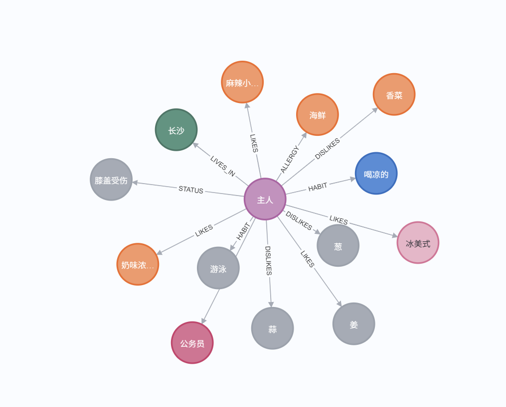

# 🎙️ M-RAG-Voice: Identity-Aware Multimodal Voice Agent

> 一个具备**声纹身份感知**、**动态长期记忆**、**可插拔技能编排**和**车控 MCP 协议**能力的智能语音助手框架。

    

## 📖 项目简介

本项目的定位是**语音智能体 + 技能编排 + 车控 MCP**，已从早期的"单体语音助手"演进为"可插拔技能代理雏形"。不同于传统语音助手，它不仅能听懂"你在说什么"，还能识别"你是谁"，并通过多路由意图识别与技能编排，将用户请求分发到联网搜索、知识图谱点餐、声纹注册、车控等不同技能通道，最终由 LLM 生成个性化回答。

### ✨ 核心特性

- **👥 多用户声纹识别**: 集成 CAM++ 模型，支持 1:N 声纹匹配。自动区分"主人"与"访客"，支持语音指令注册新用户。
- **🧠 动态进化记忆**: 基于 Milvus 向量数据库 + Neo4j 知识图谱构建用户画像，**强调双库数据一致性**。
  - 冲突裁决机制：自动利用 LLM 分析新旧记忆冲突，实现记忆的自我更新与修正。
  - 冗余检测：识别语义重复记忆，避免冗余存储。
  - 与 Mem0 的区别：Mem0 侧重插入而不强调数据一致性，本项目通过冲突裁决确保长期记忆的准确性和可靠性。
- **🔀 多路由意图识别**: 三级 fallback 策略——LLM Function-Calling 路由 → 启发式关键词路由 → 微调 BERT 分类，兼顾精度与延迟。
- **🛠️ 可插拔技能编排**: SkillRegistry + SkillOrchestrator，9 个已注册技能（联网搜索、点餐、声纹注册、6 项车控）。
- **🚗 车控 MCP 协议链**: 完整的 MCP (Model Context Protocol) 集成——MCPGateway 白名单/限流/审计 + VehicleBus 多适配器 (Mock/HTTP/MCP-stdio) + 独立 MCP Server。
- **⚡ 端云混合架构**: 端侧运行 VAD、ASR、声纹识别、TTS；云侧/本地灵活部署 LLM (DeepSeek/Qwen)。
- **🔧 大模型微调**: 使用 CARMEM 车载对话数据集 LoRA 微调 Qwen3-4B-Instruct，构建个性化座舱交互模型。
- **📊 可观测性**: Langfuse trace/span/generation 埋点，支持降级运行。

## 🏗️ 系统架构

### 整体架构：三层流水线 + 记忆层 + 车控层

```
┌─────────────────────────────────────────────────────────────────┐
│                      接口层 (Interface Layer)                    │
│   音频采集 → VAD → 唤醒词 → ASR (SenseVoice) → 声纹识别 (CAM++)   │
└──────────────────────────┬──────────────────────────────────────┘
                           │
┌──────────────────────────▼──────────────────────────────────────┐
│                      技能层 (Skill Layer)                        │
│   意图路由 (LLM→关键词→BERT) → 技能编排 → [搜索|点餐|车控|注册]    │
│                                │                                │
│                     MCPGateway (白名单/限流/审计)                 │
│                                │                                │
│                     VehicleBus (Mock/HTTP/MCP-stdio)            │
└──────────────────────────┬──────────────────────────────────────┘
                           │
┌──────────────────────────▼──────────────────────────────────────┐
│                      大脑层 (LLM Layer)                          │
│   记忆召回 (Milvus+Neo4j) → 上下文压缩 → LLM 流式生成 → TTS 输出   │
│                     ↓ (后台)                                     │
│   记忆提取 → 冲突裁决 → 双库同步写入                                │
└─────────────────────────────────────────────────────────────────┘
```

### Audio-Text-Audio 闭环架构（含身份层）


### Neo4j 知识图谱



### 前端界面


## 📋 项目任务清单

### ✅ 已完成
- [x] 多用户自动声纹识别
- [x] 动态上下文压缩（三级策略）
- [x] 长短期记忆库（短期 Memory + 长期 Milvus + Neo4j 知识图谱）
- [x] 人声检测和播报互斥机制
- [x] 用户偏好动态更新与冲突裁决
- [x] 基于知识图谱的长期记忆（Neo4j）
- [x] 微调本地模型构建个性化座舱交互模型
- [x] 实时语音播报（边生成边播报）
- [x] 前端界面（Gradio）
- [x] 多路由意图识别（LLM → 启发式 → BERT 三级 fallback）
- [x] 可插拔技能编排（SkillRegistry + SkillOrchestrator）
- [x] 车控 MCP 协议链（MCPGateway + VehicleBus + MCP Server）
- [x] 三层解耦流水线（Interface/Skill/LLM）
- [x] Langfuse 可观测性埋点
- [x] TTS 方案性能基准测试（pyttsx3 / Edge-TTS / CosyVoice）
- [x] 安全修复（密钥占位符、.env 模板、.gitignore 补全）

### 📌 进行中 / 待完成
- [ ] P1 安全修复（Cypher 注入防护、Milvus 过滤校验、HTTP timeout）
- [ ] BERT 路由返回值一致性修复
- [ ] Knowledge_Graph.search_food 方法补齐
- [ ] 配置治理：去除硬编码绝对路径，改为环境变量 + 配置文件
- [ ] 自动化回归测试（意图路由、技能分发、车控 MCP、记忆一致性）

## 📂 项目结构

```text
.
├── SenseVoice_Agent_Main.py       # 主入口：音频 I/O、VAD、多线程调度、流水线选择
├── SenseVoice_Agent_Brain.py      # 核心大脑：意图路由、RAG 检索、记忆提取与冲突裁决
├── Local_Model.py                 # 模型加载器：单例管理 LLM, ASR, CAM++, CosyVoice, Embedding
├── SpeakerManager.py              # 身份管理：声纹注册、加载与 1:N 匹配
├── Milvus.py                      # 数据层：Milvus 向量库 CRUD 与 Embedding 操作
├── Knowledge_Grpah.py             # 知识图谱：Neo4j 关系写入、删除与图谱检索
├── intent_router_service.py       # 意图路由服务：LLM → 启发式 → BERT 三级 fallback
├── intent_router_bert.py          # BERT 意图分类器（rbt3 微调，4 分类）
├── skills.py                      # 技能注册中心：9 个技能定义与参数 Schema
├── orchestrator.py                # 技能编排器：统一分发与结构化元数据回传
├── three_layer_pipeline.py        # 三层解耦流水线：Interface/Skill/LLM
├── mcp_gateway.py                 # MCP 网关：白名单、限流、审计
├── vehicle_bus.py                 # 车控总线适配器：Mock/HTTP/MCP-stdio
├── vehicle_mcp_server.py          # 独立 MCP Server：stdio JSON-RPC 车控工具
├── langfuse_monitor.py            # Langfuse 可观测性封装（支持降级）
├── webui.py                       # CosyVoice Gradio Web UI
│
├── BERT-Finetuing/                # BERT 意图分类器微调（rbt3 + 4 标签训练数据）
├── Fine-Tuning/                   # Qwen3-4B LoRA 微调（CARMEM 数据集）
├── LLM deployment/                # LLM 部署指南（Xinference/vLLM + 性能基准）
├── iic/                           # 模型权重：CAM++ / CosyVoice-300M
├── SpeakerVerification_DIR/       # 声纹注册音频文件
├── fig/                           # 架构图与截图
├── output/                        # 运行时音频临时文件
│
├── Agent_ASR_V1 (history)/        # V1：基础 ASR+LLM+记忆（无知识图谱）
├── Agent_ASR_V2(history)/         # V2：增加知识图谱，无实时播报
├── Agent_ASR_V3(history)/         # V3：关键词+BERT 路由，降低 token 消耗
├── Agent_ASR_V4(history)/         # V4：上一版本（重构前）
│
├── .env.example                   # 环境变量模板（必填项）               
└── requirements.txt               # 项目依赖
```

## 🚀 快速开始

### 1. 环境准备

- Python 3.10+
- NVIDIA GPU（推荐，用于 ASR / 声纹 / TTS 本地推理加速）
- 运行中的 Milvus 实例（Docker 或 Cloud）
- 运行中的 Neo4j 实例（本地 Docker）

```bash
git clone https://github.com/CHM00/Agent_ASR.git
cd Agent_ASR
pip install -r requirements.txt
```

### 2. 模型下载与配置

修改 `Local_Model.py` 中的模型路径，指向本地模型权重：

```python
# Local_Model.py
self.llm_model_path = r"path/to/your/Qwen"
self.funasr_model_path = r"path/to/SenseVoice"
self.CAM_model_path = r"path/to/CAM++"
self.cosyvoice_model_path = r"path/to/CosyVoice-300M"  # 可选
```

### 3. 环境变量配置

复制 `.env.example` 为 `.env`，填入必要配置：

```bash
cp .env.example .env
```

```env
# LLM API（如使用 DeepSeek / Volcengine ARK）
ARK_API_KEY=your_ark_api_key
ARK_BASE_URL=https://ark.cn-beijing.volces.com/api/v3

# Milvus 向量数据库
URL=http://127.0.0.1:19530
Token=your_milvus_token

# Tavily 联网搜索
trivily_key=your_tavily_api_key

# Neo4j 知识图谱
NEO4J_URI=bolt://localhost:7687
NEO4J_USER=neo4j
NEO4J_PASSWORD=your_neo4j_password

# Langfuse 可观测性（可选）
LANGFUSE_ENABLED=false
LANGFUSE_PUBLIC_KEY=
LANGFUSE_SECRET_KEY=
LANGFUSE_HOST=https://cloud.langfuse.com

# 流水线模式（orchestrator | legacy | three-layer）
PIPELINE_MODE=orchestrator

# 车控适配器（mock | http | mcp-stdio）
VEHICLE_ADAPTER=mock
```

### 4. 运行

```bash
# 启动主程序
python SenseVoice_Agent_Main.py

# （可选）启动独立 MCP 车控 Server
python vehicle_mcp_server.py --server-name vehicle-mcp-server --server-version 0.1.0

# （可选）启动 CosyVoice TTS Web UI
python webui.py
```

### 5. 最小可运行路径（Mock 模式）

如无需车控和 LLM API，可将 `VEHICLE_ADAPTER=mock` 并使用本地 Qwen 模型，即可在纯本地环境跑通语音识别 → 意图路由 → BERT 分类 → 闲聊的完整链路。

## 💡 使用指南

- **初次运行**: 若声纹库为空，系统会提示注册。请根据语音提示录入"主人"的声音。
- **唤醒**: 对着麦克风说 **"小明同学"** 即可唤醒助手。
- **功能示例**:
  - **记忆存储**: "我以后不吃辣了，记住哦。" → 系统更新数据库，删除旧的喜辣记忆
  - **个性化问答**: "我今天中午吃什么好？" → 系统检索你的历史口味推荐
  - **联网搜索**: "今天天气怎么样？" → 触发 Tavily 搜索技能
  - **车控指令**: "把空调调到 24 度" → 触发 MCP 车控技能（需配置适配器）
  - **声纹注册**: "我是张三，把我的声音录进去。" → 触发注册流程

## 🔀 意图路由机制

系统采用三级 fallback 策略确保意图识别的鲁棒性：

| 优先级 | 策略 | 延迟 | 适用场景 |
|--------|------|------|----------|
| 1 | LLM Function-Calling | ~800ms | 复杂意图、多轮对话、需要槽位提取 |
| 2 | 启发式关键词 | <10ms | 车控指令（空调/车窗/座椅/导航/媒体/状态） |
| 3 | 微调 BERT (rbt3) | <50ms | 4 类基础意图（闲聊/搜索/点餐/注册）兜底 |

## 🛠️ 技能列表

| 技能名 | 说明 | 触发示例 |
|--------|------|----------|
| `web_search` | Tavily 联网搜索 | "今天新闻" |
| `order_food` | 知识图谱菜品检索 | "中午推荐什么" |
| `register_voice` | 声纹注册 | "录入我的声音" |
| `vehicle_climate` | 空调控制 | "空调调到 24 度" |
| `vehicle_window` | 车窗控制 | "打开车窗" |
| `vehicle_seat` | 座椅控制 | "座椅加热" |
| `vehicle_navigation` | 导航控制 | "导航到公司" |
| `vehicle_media` | 媒体控制 | "播放音乐" |
| `vehicle_status` | 车辆状态查询 | "当前油量" |

## 📊 TTS 性能基准测试

> 测试环境：LLM (DeepSeek-V3 API) + ASR (SenseVoice 本地) + 单显卡工作站

| 方案 | 类型 | 首字延迟 | LLM 端到端 | 关键词+BERT 端到端 | 语音自然度 | 适用场景 |
|------|------|----------|-----------|-------------------|-----------|----------|
| **pyttsx3** | 本地系统引擎 | **<0.5s** | **7-9s** | **5-6s** | ⭐⭐ | 调试、极速交互 |
| **Edge-TTS** | 在线 Azure API | 1.5-3s | 9-12s | 7-10s | ⭐⭐⭐⭐ | 兼顾速度与音质 |
| **CosyVoice** | 本地生成式 AI | 5-11s | 14-25s | 12-23s | ⭐⭐⭐⭐⭐ | 离线数字人、高拟真 |

**性能瓶颈分析**: 即使使用秒回的 pyttsx3，系统仍有 7s+ 延迟，主因是串行网络链路（意图识别 API → 联网搜索 → 最终生成）。通过意图识别本地化（BERT+关键词）和搜索结果截断，目标可将延迟降至 3-4s。

## 🧪 记忆冲突裁决测试

| 测试场景 | 旧记忆 | 新输入 | 预期行为 |
|----------|--------|--------|----------|
| 喜好反转 | 我超级喜欢吃香菜 | 我现在一点都不吃香菜了 | 删除旧记忆，写入新记忆 |
| 状态更新 | 我还在上大学 | 我终于工作了，现在是程序员 | 更新身份属性 |
| 逻辑冲突 | 我对海鲜严重过敏 | 今晚麻辣小龙虾真好吃 | 识别冲突，保留过敏提醒 |
| 属性覆盖 | 我只喝热水 | 给我来冰美式，越冰越好 | 更新温度偏好 |

### 已知待优化项
- 地点冲突识别不理想（上海→杭州迁移未召回冲突）
- 语义隐含冲突识别不足（海鲜过敏 vs 吃小龙虾，语义检索未召回）
- 冗余记忆去重尚不完善

## ⚠️ 安全声明

- **密钥管理**: 所有凭据必须通过 `.env` 文件管理，**严禁**将真实 API Key 或密码提交至仓库。
- **注入防护**: 当前 Neo4j Cypher 查询和 Milvus 过滤表达式存在注入风险（已识别，P1 修复中）。
- **日志脱敏**: 确保运行日志中不包含用户密钥或敏感个人信息。
- **测试范围**: 本项目为研究原型，未经安全加固前不建议直接面向公网部署。

## 🏷️ 版本信息

当前版本: **v0.5.0-alpha**（安全与工程化修复版）

发布门槛:
- [x] 无明文密钥泄露
- [ ] 关键注入面已封堵
- [ ] 主流程回归测试通过
- [x] README 与代码一致

## ⚠️ 注意事项

- **硬件要求**: 推荐 NVIDIA GPU 运行 ASR 和声纹模型以获得最佳延迟。`Local_Model.py` 会自动检测 CUDA。
- **路径配置**: 请检查 `Local_Model.py` 中的绝对路径，确保在本机有效。
- **CosyVoice**: 若未配置 CosyVoice 模型路径，系统自动降级为 pyttsx3 / Edge-TTS。

## 🤝 贡献

欢迎提交 Issue 和 PR！如果你有更好的记忆管理策略、意图路由方案或车控技能实现，请随时分享。

## 🙏 Acknowledgments

- [ASR-LLM-TTS](https://github.com/ABexit/ASR-LLM-TTS) — 项目基础框架
- [3DSpeaker / CAM++](https://github.com/modelscope/3D-Speaker) — 声纹识别模型
- [FunASR / SenseVoice](https://github.com/modelscope/FunASR) — 语音识别模型
- [CosyVoice](https://github.com/FunAudioLLM/CosyVoice) — 语音合成模型
